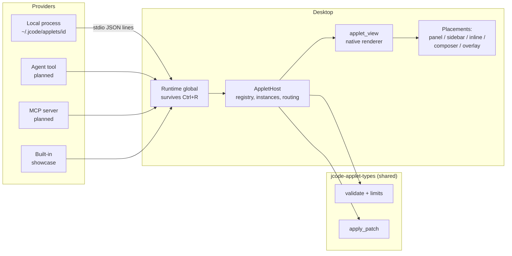

# Applet API: a standard layer for custom UI in Jcode Desktop

Status: foundation implemented. Shared types live in `jcode/crates/jcode-applet-types`.
The Desktop host, renderer, panel placement and stdio provider live in `jcode-desktop-ui`.
The agent provider, the MCP bridge and the non-panel placements are next.

## Why

Before this, every custom surface was hand-wired into `Panel`. For example, Gmail needed
`gmail_inbox`, `new_gmail`, `render_gmail`, focus special cases, a workspace action and a
sidebar button. Only in-tree Rust could add one. Applets make custom UI **data**:
anyone can describe it, and Desktop renders it natively, safely and on-theme.

## Core ideas

1. **Declarative, never code.** A provider sends a `View` tree built from a closed set of
   native components. The host owns pixels, theme, fonts, radii, motion, focus and input.
   Controls are always pills, so applets can't break the visual language.
2. **Placement is independent of tool calls.** Each mounted `Instance` picks a
   `Placement`. A tool card is just `Inline` anchored to a `call_id`.
3. **The host is the source of truth.** Every document is validated before it
   renders. Invalid messages never change the screen. They're recorded on the
   instance and reported to the provider.
4. **Robust by construction.** Revisioned atomic patches, resync on mismatch,
   resource limits, capability gating, forward-compatible unknown nodes, and
   lifetimes that survive hot reload.



## Placements

| Placement | Use | Status |
| --- | --- | --- |
| `panel` | First-class tiled panel, like the Gmail inbox | Implemented (`applet://<instance>` panels, restored after reload) |
| `inline` + `tool_call` anchor | Replaces a tool call's generic row (tool cards) | Host lookup implemented, transcript hook next |
| `inline` + `after_message` / `end` | Cards in a chat that aren't tied to any tool call | Types and host implemented, transcript hook next |
| `sidebar` | Compact status and launchers | Types and host implemented |
| `composer` | A strip above a session's composer (suggestions, pickers) | Types and host implemented |
| `overlay` | A floating corner HUD (timers, now playing) | Types and host implemented |
| `background` | No UI. Posts toasts and launches panels | Types and host implemented |

`Move` lets a provider promote an instance (for example, an inline card to a panel) without
losing state. `Scope` (`global`, `workspace`, `session`) controls where an instance is
visible. `Lifetime` controls survival:

| Lifetime | Provider disconnects | UI hot reload | App restart |
| --- | --- | --- | --- |
| `ephemeral` | removed | removed | removed |
| `session` (default) | kept, shows an error | kept | removed |
| `persistent` | kept, shows an error | kept | restored, then reconciled |

Snapshots are **revalidated on restore**, so a stale or tampered snapshot can't get past
validation.

## Images and assets

- Declare an image once in `assets` (`{id, mime, data}` as base64) and reference it with
  `{"asset": id}`. Patches that change text never resend image bytes.
- The host **sniffs the bytes** and rejects images whose declared MIME doesn't match. It
  decodes each image once, keyed by content hash, and shares decoded images across
  instances.
- Other sources: small inline `data:` URIs (capped at 256 KiB), absolute `path`
  (needs `read_files`), and `https` `url` (needs `remote_images`, fetched without
  credentials).
- `aspect_ratio` reserves layout space before the pixels decode, so layout never jumps.
- Supported types: `fit` (`contain`, `cover`, `fill`), `shape` (`rounded`, `circle`,
  `square`), PNG, JPEG, GIF, WebP, and static SVG.

## Components (schema `jcode.applet/1`)

| Group | Nodes |
| --- | --- |
| Layout | `stack` (direction, gap, padding, align), `grid` (responsive columns), `scroll`, `card` (`rounded_xl`, don't nest), `tabs`, `spacer`, `divider` |
| Content | `text` (body, title, heading, caption, mono; tone; max_lines), `markdown`, `code`, `image`, `icon`, `key_value`, `table`, `progress`, `empty`, `error` (with retry) |
| Controls (pills) | `button` (primary, secondary, compact, danger), `chip`, `toggle`, `input` (single line or multiline), `select` (segmented pills), `list` + `list_item` (leading image or icon, badges, meta) |
| Escape hatch | `html` (sandboxed WebKit, needs the `html` capability) |

Every node accepts `key` (stable identity across patches, so focus and scroll survive
reordering) and `fallback` (text shown by hosts that don't know the node type). Unknown
types keep their raw fields, so relaying and persisting them is lossless.

Spacing uses tokens (`none`, `xs`, `sm`, `md`, `lg`, `xl`), not pixels. Colors use
tones (`default`, `dim`, `accent`, `success`, `warning`, `danger`), not hex values.

The complete reference example is
`crates/jcode-desktop-ui/src/applet_showcase.json`. It is also what the screenshot
fixture renders (`scripts/screenshot.py --transcript applet --applet-tab media`).

## Protocol

Provider → host (`ProviderMessage`): `register`, `mount`, `patch`, `move`, `toast`,
`busy`, `close`.

Host → provider (`HostMessage`): `action` (includes the current local state and
`source_key`), `launch`, `resync`, `visibility`, `closed`, `rejected`.

- **State.** Inputs, toggles, selects and tabs bind to keys in `document.state`. They
  update locally right away, and every action carries the current state.
- **Patches.** RFC 6902 style `add`, `replace` and `remove`, restricted to `/view`,
  `/state` and `/title`. Each patch carries `base_revision`. The host applies it to a copy,
  then revalidates. A mismatch keeps the last good document and sends `resync`.
- **Ownership.** A provider can only patch, move or close its own instances, and can only
  register its own id.

### Host actions and capabilities

Action names that start with `host.` are handled by Desktop. Each needs a capability
declared in the manifest. Capabilities are checked when a document is validated **and**
again when an action is dispatched.

| Action | Capability |
| --- | --- |
| `host.open_url` (only http, https or mailto) | `open_url` |
| `host.copy` | `clipboard` |
| `host.start_chat` | `start_chat` |
| `host.send_prompt` | `send_prompt` |
| `host.open_file` | `read_files` |
| `host.close`, `host.set_state` | always allowed |

### Limits (defaults)

| Limit | Value |
| --- | --- |
| Depth | 24 |
| Nodes | 5,000 |
| Text | 1 MB |
| Inline image | 256 KiB |
| Single asset | 8 MiB |
| All assets | 32 MiB, 256 assets |
| Table cells | 20,000 |
| HTML | 256 KiB |
| State | 256 KiB |
| Provider line | 48 MiB |

## Local applets (available now)

```text
~/.jcode/applets/weather/applet.json
{"id": "weather", "command": ["python3", "provider.py"], "autostart": true}
```

The provider speaks newline-delimited JSON on stdin and stdout. It receives
`JCODE_APPLET_ID` and `JCODE_APPLET_SCHEMA` in its environment. A minimal provider:

```python
import json, sys
send = lambda m: (sys.stdout.write(json.dumps(m) + "\n"), sys.stdout.flush())
send({"type": "register", "manifest": {"schema": "jcode.applet/1", "id": "weather", "title": "Weather"}})
send({"type": "mount", "instance": "w1", "placement": {"kind": "overlay"},
      "document": {"revision": 1, "title": "Weather", "view":
        {"type": "button", "label": "Refresh", "on_press": {"action": "refresh"}}}})
for line in sys.stdin:
    msg = json.loads(line)
    if msg["type"] == "action":
        ...  # patch with base_revision, or mount a full document
```

A provider that crashes only marks its own instances with an error. A malformed line gets
a `rejected` reply and is otherwise ignored.

To share an applet, publish it to the catalog at <https://jcode.sh/applets>. The
package format, capability risk labels and anti-abuse rules are in
[applet-catalog.md](applet-catalog.md).

## Code map

| Piece | Location |
| --- | --- |
| Wire types, validation, patches, limits | `jcode/crates/jcode-applet-types` |
| Host core (registry, instances, routing, snapshots, asset cache) | `jcode-desktop-ui/src/applet_host.rs` |
| Runtime global and stdio provider transport | `jcode-desktop-ui/src/applet_runtime.rs` |
| Native renderer | `jcode-desktop-ui/src/applet_view.rs` |
| Panel placement | `jcode-desktop-ui/src/panel_applet.rs` |
| Workspace integration, showcase, `OpenAppletShowcase` action | `jcode-desktop-ui/src/workspace_applets.rs` |

The host/UI C ABI is unchanged. Applets are all in the reloadable UI crate, and the runtime
is an App global, so instances survive Ctrl+R.

## Next steps

1. **Transcript placements:** render `inline` instances at their anchor. Tool-call anchors
   replace the generic row. Then move the Gmail read and draft cards onto this path.
2. **Agent provider:** add an `applet` tool in `jcode-app-core` (`mount`, `patch`, `close`)
   plus harness API events, so the agent can build interactive UI and receive actions as
   tool events.
3. **Sidebar, overlay and composer hosts** in the workspace, plus a launcher row driven by
   manifest `launchers`.
4. **Capability consent UI:** approve once per applet, revoke in settings.
5. **MCP bridge:** map MCP UI resources onto applet documents.
6. **Migrate the Gmail inbox and Todoist panels** to applets, and delete their bespoke
   `Panel` fields.
