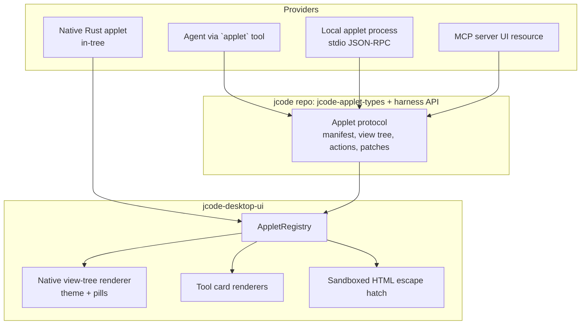

# Applet API: a standard layer for custom UI in Jcode Desktop

Status: proposal. Nothing here is implemented yet.

## Where we are today

Every custom surface is hand-wired into `Panel` (`panel.rs`, ~9.5k lines):

| Surface | How it is wired |
| --- | --- |
| Gmail inbox | `gmail_inbox` / `gmail_message` / `gmail_scroll` fields, `new_gmail`, `render_gmail`, focus special case, `OpenGmail` action, sidebar button |
| Todoist | `todoist` field, `new_todoist`, `render_todoist`, `OpenTodoist` |
| Orchestration, code file, side document, unfinished work, login | same pattern, each with its own `Option<State>` field and `if self.x.is_some()` branches in `render`, `input_focus_handle` and similar functions |
| Gmail tool cards | hard-coded `if let Some(..) = gmail_*_card::parse(..)` chain inside the transcript tool row renderer |
| Agent-authored UI | `panel` tool: Markdown or PDF only (`SidePanelPage`) |
| HTML | `html_preview.rs`: sandboxed WebKit, no command bridge |

Adding one applet touches 5 to 10 places in `panel.rs` and `workspace.rs`, and only
Rust written in this repo can add one. Neither the agent nor a third party can ship
an interactive UI.

## Goals

1. You can add an applet without editing `Panel` or `Workspace`.
2. The agent, local scripts and external services can create interactive UI, not only Rust code.
3. It works with hot reload: applet UI is data, never ABI.
4. It is secure by default: capability-gated, size-limited and validated, with no arbitrary code in the host.
5. It is native and on-theme. Applets automatically follow the pill and no-accent-rail rules.
6. It is versioned so old applets keep working.

## Architecture: four layers, one registry



### Layer 1: native applet trait (in-tree Rust)

This replaces the `Option<State>` field per surface.

```rust
pub trait Applet: 'static {
    fn manifest(&self) -> &AppletManifest;
    fn render(&mut self, cx: &mut AppletCx) -> AnyElement;
    fn focus_policy(&self) -> FocusPolicy { FocusPolicy::Panel }   // replaces the is_some() chain
    fn snapshot(&self) -> Option<serde_json::Value> { None }       // survives Ctrl+R
    fn restore(&mut self, _: serde_json::Value) {}
    fn on_action(&mut self, _: &AppletAction, _: &mut AppletCx) {}
}
```

`Panel` gets one `applet: Option<Box<dyn Applet>>` field. Gmail, Todoist and
Orchestration move to the trait one at a time. `workspace` registers each one's entry
points (sidebar button, shortcut, command palette) from the manifest, not from
hand-written actions.

### Layer 2: tool card renderers

This replaces the `if let` chain in the transcript.

```rust
pub trait ToolCardRenderer: Send + Sync {
    fn id(&self) -> &'static str;
    fn claims(&self, tool: &str, input: &str) -> bool;
    fn render(&self, call: &ToolCallView, cx: &mut ToolCardCx) -> Option<AnyElement>; // None = generic row
}
```

The transcript asks the registry and falls back to the generic row. `ToolCardCx`
provides the shared pieces the Gmail cards copy today: the expand toggle, the
transcript selection, the measurement invalidation, and `debug_selector`. Tool cards
declared through the protocol (Layer 3) also go through this trait.

### Layer 3: declarative applet protocol (the standard)

This is the part that makes applets possible for anyone. A provider sends a
**view tree** as JSON, and Desktop renders it with native GPUI components. No code
runs in the host.

**Manifest**

```json
{
  "schema": "jcode.applet/1",
  "id": "com.example.linear",
  "title": "Linear",
  "icon": "lucide:list-checks",
  "entry": [
    {"kind": "sidebar"},
    {"kind": "shortcut", "keys": "super-shift-l"},
    {"kind": "tool_card", "tool": "linear", "actions": ["get_issue"]}
  ],
  "capabilities": ["network:api.linear.app", "open_url", "clipboard_write", "start_chat"]
}
```

**View tree.** This is a small, closed component set. Unknown nodes render as
their `fallback` text, so newer applets still work in older Desktops.

| Node | Purpose |
| --- | --- |
| `stack`, `row`, `scroll`, `spacer` | layout (gap and padding tokens only, no raw pixels) |
| `text`, `markdown`, `code`, `image`, `icon` | content |
| `button` (primary / secondary / compact), `chip`, `toggle` | always rendered as pills |
| `list` + `list_item` | pill rows on a subtle fill, virtualized |
| `input`, `textarea`, `select` | form fields with bound state keys |
| `table`, `key_value`, `email`, `diff`, `progress`, `empty`, `error` | rich, pre-styled blocks. `email` is today's Gmail card, reused |
| `tabs`, `dialog` | multi-view containers (`rounded_xl`, never nested boxes) |

```json
{"type": "list", "items": [
  {"type": "list_item", "key": "m1", "title": "Invoice", "subtitle": "Stripe · 2h",
   "badges": ["unread"], "on_press": {"action": "open", "args": {"id": "m1"}}}
]}
```

**Runtime messages** (over the harness API, typed in a new `jcode-applet-types` crate):

| Direction | Message |
| --- | --- |
| provider → desktop | `applet.mount {manifest, view, state}` · `applet.patch {revision, ops}` (JSON Patch on the view or state) · `applet.toast` · `applet.close` |
| desktop → provider | `applet.action {id, action, args, state}` · `applet.visibility` · `applet.dispose` |

The protocol also guarantees these:

- **Revisions:** every patch carries `base_revision`. When the revisions don't match,
  Desktop asks for a full view. This prevents torn state.
- **Optimistic local state:** inputs and toggles update locally right away, and
  actions carry the current state. The provider decides what it means.
- **Limits:** caps on tree depth, node count, bytes and patch rate. When a view breaks
  one, Desktop shows the applet's error state rather than hanging the UI.
- **Persistence:** the last view and state are stored in the panel snapshot, so
  applets survive Ctrl+R and restarts and rehydrate before the provider reconnects.
- **Capabilities:** gated at the host. An applet cannot open URLs, write the
  clipboard or start chats unless its manifest declares that and the user has allowed
  it. Network access belongs to the provider process, never to the renderer.

**Providers**

1. **Agent:** a new `applet` tool (next to `panel`) with `mount` / `patch` / `close`.
   The agent receives actions as tool events, so "build me a dashboard for X" becomes
   a real interactive panel.
2. **Local process:** `~/.jcode/applets/<id>/applet.json` plus a command that
   speaks the protocol over stdio JSON-RPC (the same model as MCP servers).
   Any language works.
3. **MCP:** a bridge so MCP servers can expose applet views. This follows the
   emerging MCP UI-resource work where it fits, so existing servers get UI for free.
4. **Native:** Layer 1 applets can also emit view trees, which makes the declarative
   renderer the shared implementation.

### Layer 4: sandboxed HTML escape hatch

Some applets need custom visuals the component set cannot express (charts, maps).
For those, an `html` node reuses `html_preview.rs` (the isolated WebKit process)
and adds one narrow `postMessage` bridge that can only emit `applet.action`. The bridge
enforces the same capability rules. This is deliberately a second-class option.

## Where the code lives

| Piece | Repo / crate |
| --- | --- |
| `jcode-applet-types` (manifest, view tree, messages, validation, limits) | `jcode` (new crate, shared by SDK, server and desktop) |
| Harness API events and requests for applets, `applet` tool, local process host, MCP bridge | `jcode` (`jcode-harness-api`, `jcode-app-core`) |
| `AppletRegistry`, `Applet` and `ToolCardRenderer` traits, native view renderer, capability prompts | `jcode-desktop-ui` (new `applet/` module, out of `panel.rs`) |

The host/UI C ABI does not change. Everything stays in the reloadable UI crate.

## Rollout

1. **Registry refactor, no behavior change:** add `ToolCardRenderer` and move both
   Gmail cards behind it. Add the `Applet` trait and move Gmail inbox and Todoist into
   it. Screenshots and existing tests prove parity.
2. **Types and renderer:** create `jcode-applet-types` with validation plus fixture
   tests. Build the native renderer for the core nodes, add preview-catalog fixtures,
   and check them with `scripts/screenshot.py`.
3. **Agent provider:** add the `applet` tool and harness events. The agent builds a
   working interactive panel end to end.
4. **Local and MCP providers,** plus capability prompts and a sidebar applet launcher.
5. **HTML escape hatch** with the action-only bridge.

## Open questions

- Should installed local applets be allowed to register tool card renderers for
  tools they do not own?
- Do we need per-applet persistent storage in the host, or is that always
  the provider's job?
- Should there be distribution (a signed registry), or local folders only for now?
