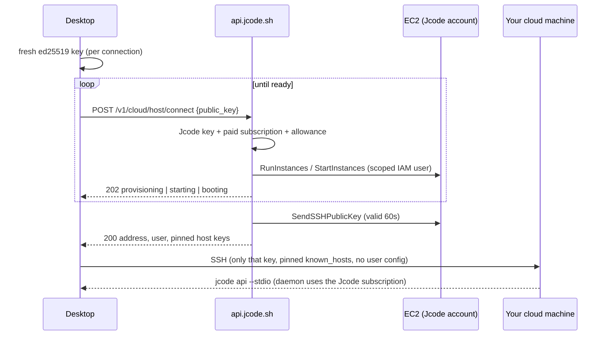

# Managed Jcode Cloud destination

## Contract

The Desktop Cloud button means Jcode-operated infrastructure authorized by the
user's Jcode account and subscription. It never means a personal AWS profile,
local `aws login`, a configured SSH alias, or the personal `jcode-cloud-alpha`
helper. Legacy `jcode-cloud-alpha` defaults and drafts migrate to the managed
destination and never run the personal helper.

## How it works

- **Backend**: `solosystems-backend/workers/api/src/cloud_hosts.js`, routes
  `GET /v1/cloud/host`, `POST /v1/cloud/host/connect`, `POST /v1/cloud/host/stop`.
  `/v1/me` reports `capabilities.cloud_hosts`.
- **Infrastructure**: `solosystems-backend/infra/jcode-cloud/managed-hosts.yaml`
  (stack `jcode-cloud-production-hosts`, us-east-1). The worker's IAM user can
  launch only from the managed launch template and can only start, stop,
  terminate, read the console of, or push keys to `jcode:managed` instances.
- **Isolation**: one machine per account, tagged `jcode:account`. Ownership is
  rechecked against EC2 tags on every request, and a mismatch fails closed.
- **Host keys**: printed to the serial console at first boot, captured and pinned
  by the control plane before any client is authorized.
- **Inference**: the machine gets its own revocable Jcode account key. The daemon
  runs `jcode --provider jcode serve`, so turns bill to the subscription. The
  key is revoked when the machine is replaced.
- **Lifecycle**: sleeps (stop, disk kept) after 30 minutes with no SSH client.
  Runtime accrues against a monthly allowance (default 50 hours), enforced by
  the connect path and a 5-minute cron. A failed first boot is terminated and
  replaced automatically.
- **Desktop**: `crates/jcode-desktop-ui/src/managed_cloud.rs`. The pending panel
  shows a live checklist: Jcode account, Cloud machine, Jcode installed, Secure
  connection, Jcode session. Failures keep the draft and queued prompts and offer
  Retry, Jcode account, and Use this computer. There is no implicit local fallback.

## Verification (2026-09-24)

- Fresh provision to first reply: about 100 seconds. Cold wake: about 46 seconds.
  Warm: about 4 seconds to a session, 5.5 seconds to a reply.
- The live Desktop test ran with `HOME` holding only the Jcode account file and
  AWS configuration pointed at `/dev/null`:
  `cargo test -p jcode-desktop-ui managed_cloud_live -- --ignored --nocapture`.
- Backend: `npm test` in `workers/api` (fake EC2, real SQLite), covering
  entitlement denial, cross-account isolation, allowance exhaustion, host-key
  pinning, failed boots, and key revocation.

## Known limits

- One region (us-east-1) and one instance type (m7i.large).
- The pinned Jcode release (`CLOUD_JCODE_VERSION`) is installed at first boot.
  Existing machines are not upgraded automatically.
- Model credentials other than the Jcode subscription are not synchronized.
